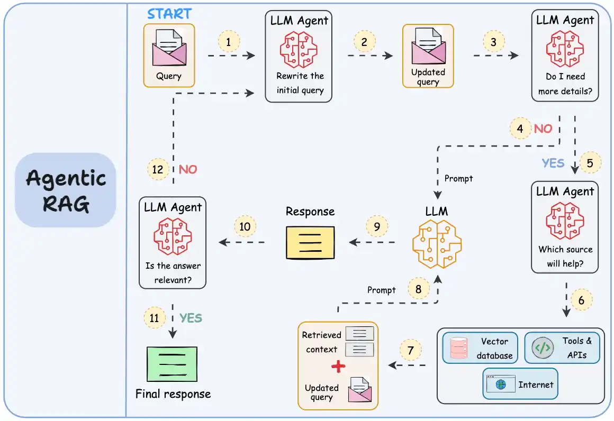

# 🧠 Agentic RAG Chat System

This project is a user-facing, chat-style **Retrieval-Augmented Generation (RAG)** system using a **local LLM (Mistral via Ollama)**. The LLM can use tools like querying a MySQL database containing real-world government documents.

---

## 🚀 Features

- ✅ Local LLM (Mistral) via Ollama  
- ✅ Daily auto-updating data pipeline (Federal Register API)  
- ✅ Tool-calling Agentic LLM (uses custom tools)  
- ✅ MySQL-based document storage  
- ✅ FastAPI backend with Swagger + HTML UI  
- ✅ Clear logging, tool triggers, and debug-friendly  

---

## 🧩 Project Structure

\`\`\`text
chat_rag_project/
├── agent/              # LLM agent logic and tool calls
│   ├── llm_agent.py
│   ├── tool_schema.py
│   └── tools.py
├── api/                # FastAPI web server
│   └── main.py
├── data_pipeline/      # Daily data fetch and clean
│   ├── downloader.py
│   ├── processor.py
│   └── run_pipeline.py
├── db/                 # MySQL DB integration
│   ├── insert_documents.py
│   ├── mysql_setup.sql
│   └── query_tools.py
├── static/             # HTML UI (Bootstrap + JS)
│   └── index.html
├── .gitignore
├── requirements.txt
└── README.md
\`\`\`

---

## ⚙️ How to Run

\`\`\`bash
# Create and activate environment
conda create -n rag_env python=3.10 -y
conda activate rag_env

# Install required packages
pip install -r requirements.txt

# Setup MySQL database
mysql -u root -p < db/mysql_setup.sql

# Download + clean + store federal data
python -m data_pipeline.run_pipeline

# Start the FastAPI server
uvicorn api.main:app --reload

# Visit the HTML UI at:
# http://localhost:8000/static/index.html
\`\`\`

---

## 🧪 Example Queries

\`\`\`text
List 3 recent documents from Energy Department about clean energy
Give me a summary of executive orders related to cybersecurity
Any test procedure updates for central air conditioners?
\`\`\`

---

## 🛠️ Notes

- **LLM used:** `mistral` from Ollama (`http://localhost:11434`)  
- **Database:** All document search operations use `aiomysql` async queries  
- **Tool usage:** Tool results are only returned if used via LLM function calls  
- **Models:** You can switch to any function-capable model (e.g., `qwen`, `llama3`, etc.)

---

> 🧾 Licensed for educational/demo use.